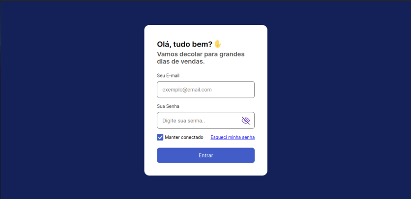
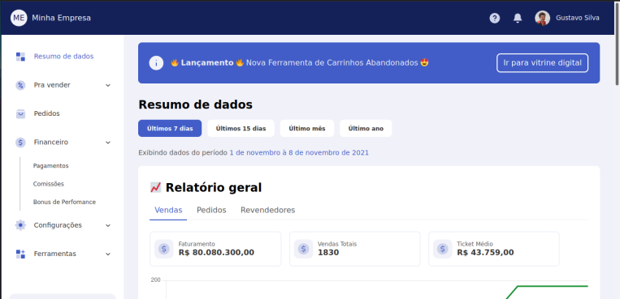
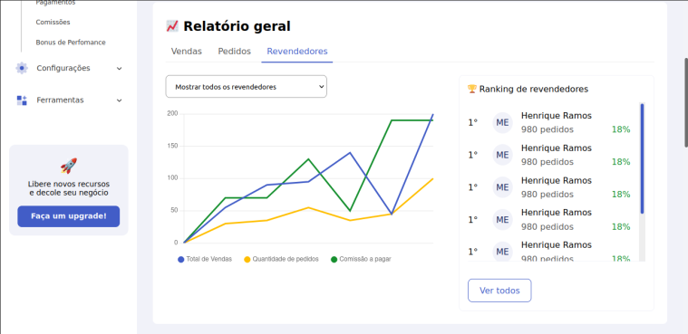

 

## 💻 Projeto

Marketplace desenvolvido para o teste seletivo da b8one com o objetivo de avaliar o desenvolvimento frontend.

O projeto está todo responsivo, adaptado para desktop, tablet e celular.
As API's disponibilizadas foram consumidas e os valores estão dinâmicos.

 

## ✨ Tecnologias

Esse projeto foi desenvolvido com as seguintes tecnologias:

- HTML
- CSS
- JavaScript

 

## 🚀 Como executar

- Execute o arquivo `src/pages/login-page/index.html` com o live server
